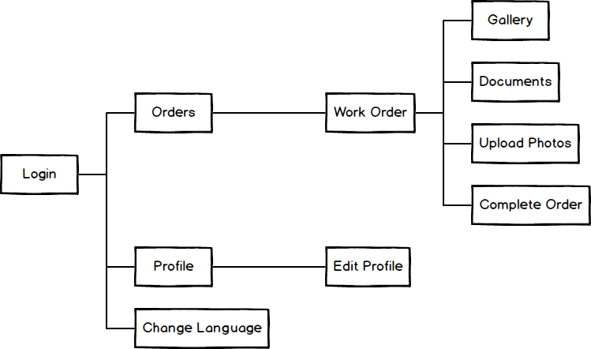
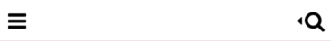
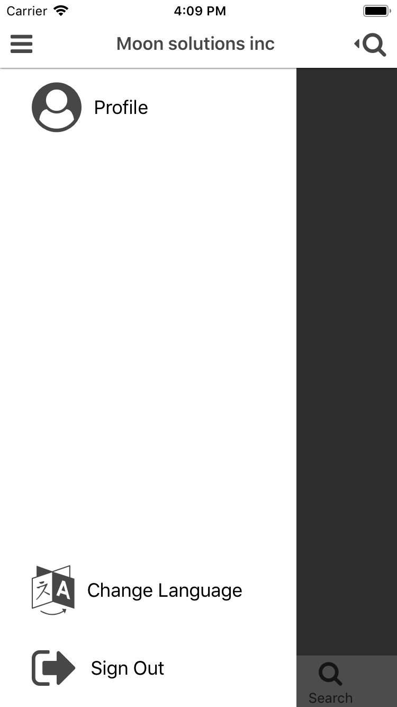
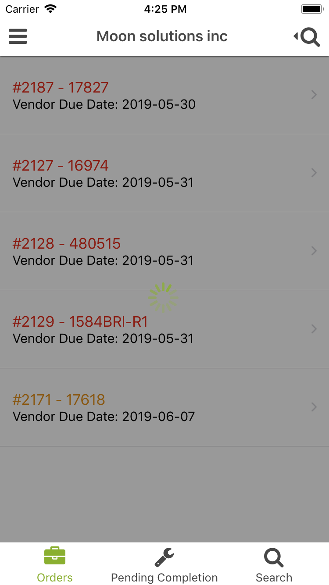
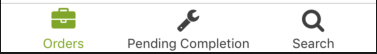

# Nuvote App

Nuvote App made with React Native to keep the orders flow for field work of vendor and other user types of NWOMS server.

## Install and Usage

Requirements: `node 8+`

- If you don't have nvm go to nvm repo an see the install guide: https://github.com/creationix/nvm

- If you have nvm already installed and a node version older than 8 follow these instructions:

1. `$ nvm install 8.11`
2. `$ nvm use 8`

To run the project in your local machine:

1. `$ npm install`
2. `$ npm start`
3. `$ ENVFILE=.env react-native run-ios` or `$ENVFILE=.env react-native run-android`

**Note for 3rd point**:

(Alternately, for ios, open xcworkspace from ios folder and run. Or android studio selecting android folder, then build the project and run).

The env files are used to avoid the unnecesary task to change url endpoints. You can change them when running the ENVFILE command: `$ ENVFILE=.env ...`, `$ENVFILE=.env.staging` etc

- .env = Nuvote production URL
- .env.staging = Nuvote testing URL
- .env.local = Local machine server URL(if properly configured with django)

Test server users:

- Vendor: bob:password123
- Coordinator: jonathan:password123

Production server users:
Ask for a test user to the current project manager of Nuvote.
## Routes

For better understanding, this app routing was made using react navigation, it consists in a starting switch navigator, and an enclosing stack navigator that contains a drawer and tab icons.

Refer to Routes docs for more information.

[Routes](./src/routes/docs.md)

## Navigation Map and Screen Description

The first screen to appear is the Login, once you have successfuly logged in, you can see your assigned active orders(if you have). At the left, in the header, there's an icon to display the drawer or simply swipe to right from the screen border. At the right, a search icon to filter your orders from the current screen.

In the drawer there are 3 options, Profile, Change Language and Log out. If you press profile, you can see your user information, also, you can edit it and save any change. In change language you can set the app language to english or spanish.

If you press any order, you will navigate to the selected Work Order. There you can see it's information, see the status photos and files. Also, upload photos and if needed, complete the order.

Work Orders have 3 types:

- Inspection
- Insurance
- Other Repairs

Work Order with type inspection only have one type of photos, Property photos, the others have Before, In Progress and After Photos. When you take a photo an alert will show to select how to save that photo. Once you taked all photos you wanted, press save to upload them into the selected order, if success you can see those photos in it's gallery type.

In the document gallery you can see the files of that order and download them, in Android devices, the downloaded files are stored in the internal storage. In iOS devices, the downloaded files are previewed.

If every photo is properly located in it's type, you can complete the order, either way an alert will be shown. If success, you will return to all orders screen, the current order will be moved to Pending Completion.



## Localization

This app contains two languages to translate, english and spanish. The default language is english, but it can be changed anytime to spanish once the user has logged in.

Refer to translation docs for more information: [Localization](./src/helpers/localization.md)

## Utils

Utils to help with layout developing.

### layout.js

Contains two functions to use responsive height and width from the phone.

#### widthPercentageToDP

Get a pixel value based in the percentage of width. The function argument is the percentage of the width screen.

```javascript
import { widthPercentageToDP } from './layout'

const width = widthPercentageToDP(30)
```

#### heightPercentageToDP

Get a pixel value based in the percentage of height. The function argument is the percentage of the height screen. If the device is iOS it ignores the status bar height.

```javascript
import { heightPercentageToDP } from './layout'

const height = heightPercentageToDP(30)
```

### responsiveFont.js

Returns a pixel value based on the percentage of device height, useful for setting font sizes.

```javascript
import responsiveFont from './responsiveFont'

const fontSize = responsiveFont(2)
```

## Components

### Collapsable


[Collapsable](./src/components/Collapsable/docs.md)

### Header



[Header](./src/components/Header/docs.md)

### Drawer


[Drawer](./src/components/Drawer/docs.md)

### Loading



[Loading](./src/components/Loading/docs.md)

### TabNav



[TabNav](./src/components/TabNav/docs.md)

### Download


[Download](./src/components/Download/docs.md)