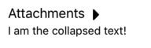

# Nuvote App

Nuvote App made with React Native

## Install and Usage

Requirements: `node 8+`

- If you don't have nvm go to nvm repo an see the install guide: https://github.com/creationix/nvm

- If you have nvm already installed and a node version older than 8 follow these instructions:

1. `$ nvm install 8.11`
2. `$ nvm use 8`

To run the project in your local machine:

1. `$ npm install`
2. `$ npm start`
3. `$ react-native run-ios` or `$ react-native run-android`

**Note for 3rd point**:

(Alternately, for ios, open xcworkspace from ios folder and run. Or android studio selecting android folder, then build the project and run)

# Components

## OrderCard

[OrderCard Docs](./src/components/OrderCard/docs.md)

## Collapsable

[Collapsable](./src/components/Collapsable/docs.md)
