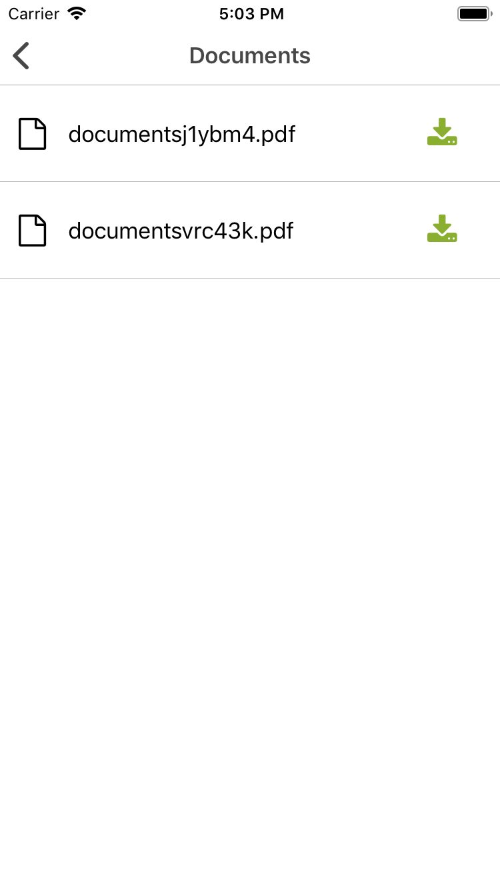
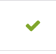
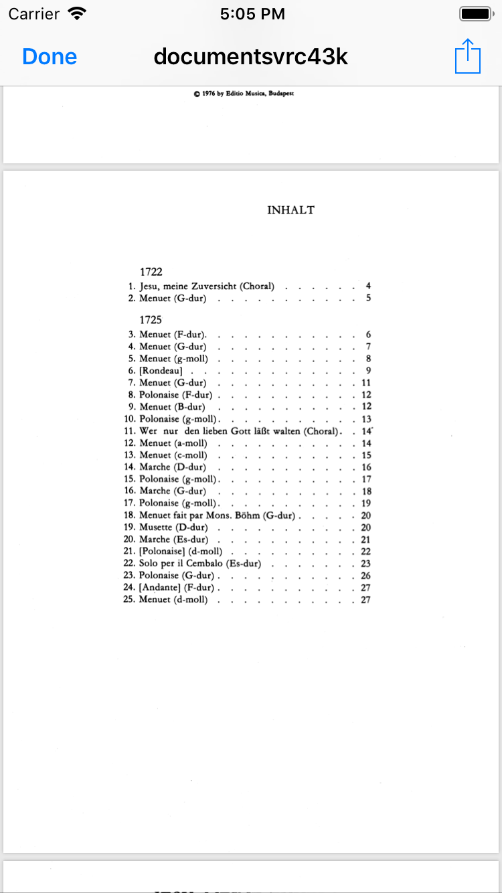

[Return](../../../README.md)

# Download

An stateful component to render an Icon and handle downloads of files for work order documents. When the download button is pressed a fetch is handled to get an url with permissions to download a file and then the download is maked, once done, if iOS a file preview is shown or if android, the file is downloaded and saved into the storage.

## Usage

It accepts as props the file id that is given by NWOMS and the file name

```javascript
import { Download } from 'components'

<Download fileId={id} filename={filename} />
```

## Screenshots








