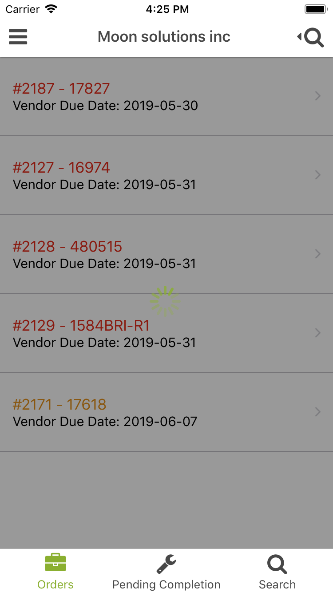

[Return](../../../README.md)

# Loading

Renders an opaque full screen with an Activity Indicator.



## Usage

The best way to used it is with a variable used only when performing an action that takes time:

```javascript
import { Loading } from 'components'
const isLoading = true

isLoading && <Loading />
```